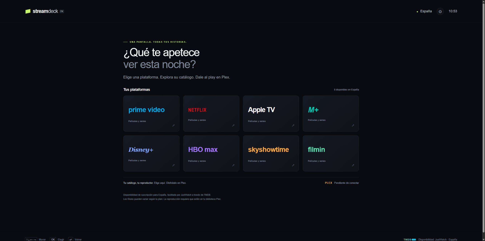
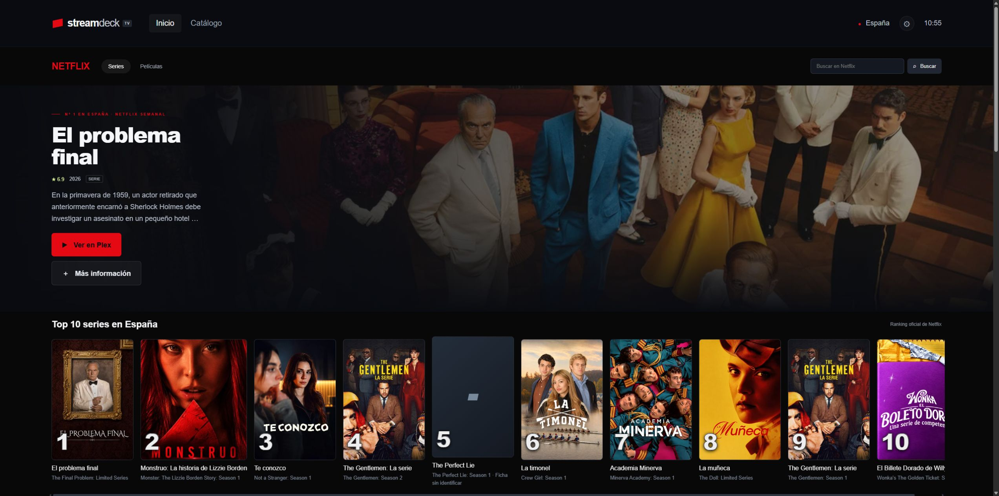
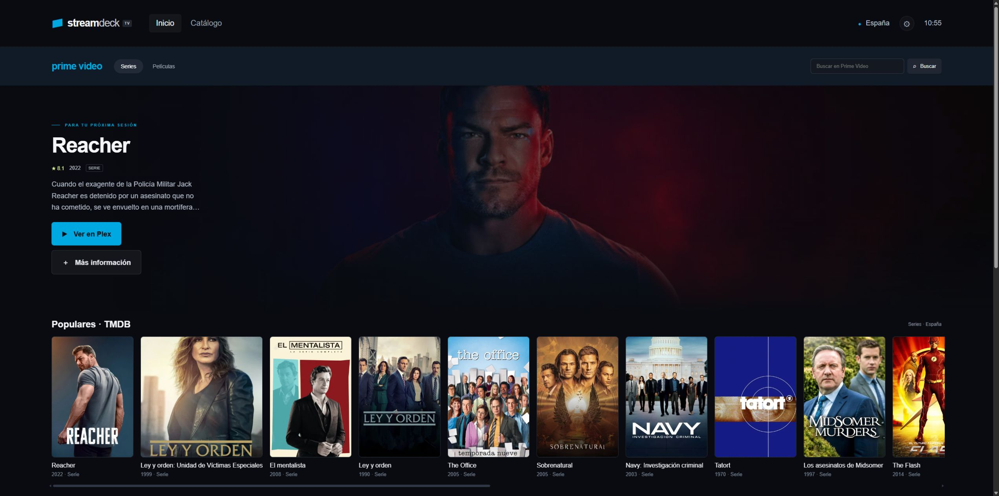

# StreamDeck TV

Catálogos de streaming para España en una interfaz pensada para televisión. Elige plataforma, explora películas y series y abre el título en Plex.

El proyecto surge para conservar una forma familiar de descubrir contenido cuando el reproductor principal es Plex. La web funciona y la adaptación a Fire TV está en desarrollo; el salto nativo debe comprobarse en el dispositivo y con su versión de Plex.

## Así funciona

1. Elige la plataforma: solo se muestran proveedores confirmados para España.
2. Explora sus filas, busca una película o serie y abre su ficha.
3. Pulsa **Ver en Plex** para buscar ese título en tu reproductor. El catálogo no garantiza que esté en tu biblioteca.

### Inicio



### Netflix



### Prime Video



Capturas de la aplicación con catálogo real. Las filas y títulos cambian con las actualizaciones de las fuentes.

## Windows: ejecutable portátil

Descarga **StreamDeck-TV.exe** desde [Releases](https://github.com/hbarragan/streamdeck-tv/releases). No requiere instalar Node.js. Abre el EXE y mantén su ventana abierta mientras usas la aplicación en el navegador. Cerrar la ventana detiene el servidor local.

Sin configuración usa el servidor público de StreamDeck en Vercel. Para utilizar tu propio servidor del NAS:

```powershell
.\StreamDeck-TV.exe --server http://IP-DEL-NAS:3477
```

También puede ejecutar el catálogo en el PC: copia `.env.example` como `.env` junto al EXE y añade tu `TMDB_TOKEN`. Plex es opcional. Para conservar el archivo privado en otra carpeta:

```powershell
.\StreamDeck-TV.exe --env-file C:\ruta\privada\streamdeck.env
```

Si el puerto 3477 está ocupado, añade `--port 3478`. `--no-open` evita abrir el navegador automáticamente y `--help` muestra las opciones. El servidor del EXE escucha solo en el propio PC; para servir a Fire TV usa el despliegue Node o Docker en la LAN.

### Compilar el EXE

Desde Windows con Node.js 22 o posterior:

```powershell
git clone https://github.com/hbarragan/streamdeck-tv.git
cd streamdeck-tv
npm ci
npm run build:exe
```

Genera `dist/StreamDeck-TV.exe`, `.env.example` y `SHA256SUMS.txt`. Node y los cinco archivos públicos están incluidos. La compilación usa [Node SEA](https://nodejs.org/api/single-executable-applications.html), esbuild y postject; no incorpora `.env`, tokens, sesiones ni configuración del NAS. El ejecutable es portátil y no está firmado con un certificado de distribución.

## Funciones

- Plataformas confirmadas por TMDB/JustWatch en España: Prime Video, Netflix, Apple TV, Movistar Plus+, Disney+, Max, SkyShowtime y Filmin.
- Catálogo de suscripción, búsqueda por plataforma, fichas y paginación.
- Netflix con Top 10 semanal oficial de España y filas de géneros.
- Temas visuales por plataforma y navegación con mando.
- Búsqueda inmediata en Plex Web y envoltura Android con intents dirigidos a Plex.

La popularidad de TMDB no equivale a audiencia oficial. Los estrenos se ordenan por fecha del título, no por incorporación a la plataforma. El Top 10 de Netflix indica su semana y no reproduce la portada personalizada de una cuenta. Los títulos del ranking que no pueden identificarse conservan su puesto y no ofrecen reproducción.

## Ejecutar

Requiere Node.js 22 o posterior, sin dependencias de producción.

```powershell
git clone https://github.com/hbarragan/streamdeck-tv.git
cd streamdeck-tv
npm ci
Copy-Item .env.example .env
# Configura TMDB_TOKEN (API Read Access Token).
npm start
```

Abre http://localhost:3477. La disponibilidad se comprueba para España y suscripciones; la aplicación no proporciona archivos de vídeo. La reproducción requiere acceso al contenido correspondiente en Plex.

## Credenciales

Este repositorio no contiene claves, sesiones, APK personales ni configuración privada. Guarda las credenciales fuera del repositorio o en variables privadas del servidor. Para ejecutar con un archivo externo:

```powershell
node --env-file=C:/ruta/privada/runtime.env server/index.js
```

TMDB_TOKEN es necesario para el catálogo. PLEX_URL, PLEX_TOKEN, PLEX_SERVER_ID, PLEX_LIBRARY_IDS, PLEX_HOME_URL y PLEX_SERVER_NAME permiten conectar tu biblioteca. El enlace de búsqueda web no requiere un token Plex. Ninguna respuesta de la API devuelve claves.

El script opcional `scripts/connect-plex.mjs` usa autorización PIN. Configura tu propio PLEX_SERVER_ID y las bibliotecas antes de usarlo. Admite STREAMDECK_ENV_FILE para guardar la configuración fuera del proyecto. Nunca publiques archivos de credenciales.

## NAS con Docker

La imagen solo incluye Node, servidor y archivos públicos. El volumen externo `streamdeck-private` contiene `streamdeck.env`, con permisos 0600 y propietario 1000. El contenedor lo monta en modo lectura, ejecuta como usuario node y arranca con `--env-file`. Tiene reinicio automático, healthcheck y límites de memoria/CPU.

```powershell
docker build --platform linux/arm64 -t streamdeck-tv:1.2.0-arm64 .
docker volume create streamdeck-private
Copy-Item .env.example C:\ruta\privada\streamdeck.env
# Edita ese archivo y configura TMDB_TOKEN antes de continuar.
docker create --name streamdeck-config --user root --network none `
  --mount type=volume,src=streamdeck-private,dst=/run/secrets `
  --entrypoint node streamdeck-tv:1.2.0-arm64 -e "process.exit(0)"
docker cp C:\ruta\privada\streamdeck.env streamdeck-config:/run/secrets/streamdeck.env
docker start -a streamdeck-config
docker run --rm --user root --network none `
  --mount type=volume,src=streamdeck-private,dst=/run/secrets `
  --entrypoint node streamdeck-tv:1.2.0-arm64 -e `
  "const fs=require('node:fs');fs.chownSync('/run/secrets/streamdeck.env',1000,1000);fs.chmodSync('/run/secrets/streamdeck.env',0o600)"
docker rm streamdeck-config
$env:STREAMDECK_BIND_IP = 'IP-DEL-NAS'
docker compose up -d --wait
```

El puerto es 3477. En QNAP se utiliza la red bridge existente para evitar crear un switch virtual adicional. `scripts/deploy-nas.ps1` admite host, directorio de certificados TLS y archivo privado mediante parámetros; no incluye esos datos. Comprueba que el puerto está libre antes de instalar. No es necesario detener otros servicios.

## Vercel

Producción: https://streamdeck-tv.vercel.app. `api/index.js` reutiliza el mismo manejador HTTP. Configura los secretos como variables sensibles en Vercel. `.vercelignore` excluye credenciales y compilaciones Android.

```powershell
vercel link
vercel deploy --prod
```

## Fire TV

La envoltura Android está en `android/`: pantalla horizontal, launcher de televisión y control con flechas/OK/Volver. Requiere Plex instalado y configurado. El catálogo consulta la dirección de servidor elegida; puedes usar el NAS o Vercel. STREAMDECK_API_BASE permite configurar la dirección predeterminada al compilar.

```powershell
npm run android:build
```

Para instalar la APK en el Fire TV, activa la depuración ADB en sus opciones de desarrollador y usa Android Platform Tools en el PC:

```powershell
adb connect IP-DEL-FIRE-TV:5555
adb install -r dist/streamdeck-firetv.apk
```

Acepta la conexión de depuración en el televisor. Abre StreamDeck y configura en **Conexión y ajustes** la dirección de tu servidor Node, por ejemplo `http://IP-DEL-NAS:3477`. Instala y configura Plex en el Fire TV antes de probar **Ver en Plex**. El PC y el Fire TV deben poder llegar al servidor.

El script usa Android SDK 35, Gradle 8.11.1 y JDK 17 o 21; admite rutas mediante parámetros. Genera una APK de depuración para sideload personal en `dist/`. La compilación normal no incluye claves. La variante `-IncludeCredentials` es opcional para uso privado y genera un archivo que permite extraer sus claves; sus assets y APK quedan excluidos de Git. No publiques esa variante.

La app intenta ACTION_SEARCH en Plex. En una variante privada puede consultar la biblioteca y abrir un resultado inequívoco mediante enlace nativo. Si no encuentra el título o el enlace no está soportado, abre Plex y muestra el título que debes buscar. No utiliza un navegador como alternativa en Fire TV. La compatibilidad debe verificarse en el dispositivo real; no se considera terminada la integración nativa.

## Verificación

```powershell
npm test
# Después de compilar en Windows:
npm run test:exe
```

Las pruebas verifican proveedores, disponibilidad en España, búsqueda, ranking oficial, emparejamiento Plex y protección de rutas/credenciales. Solo las pruebas utilizan respuestas simuladas.

## Fuentes y atribución

- [TMDB](https://developer.themoviedb.org/reference/discover-movie): catálogo y disponibilidad facilitada por JustWatch.
- [Netflix Tudum](https://www.netflix.com/tudum/top10/spain): Top 10 semanal oficial de España.
- [Intents Plex](https://forums.plex.tv/t/android-intents/755047): enlaces nativos; su compatibilidad depende de la versión.

This product uses the TMDB API but is not endorsed or certified by TMDB. StreamDeck es independiente de las plataformas mostradas. Marcas y materiales promocionales pertenecen a sus titulares.
